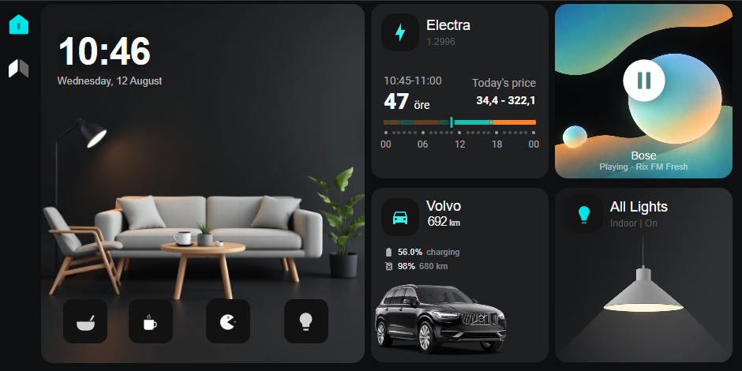
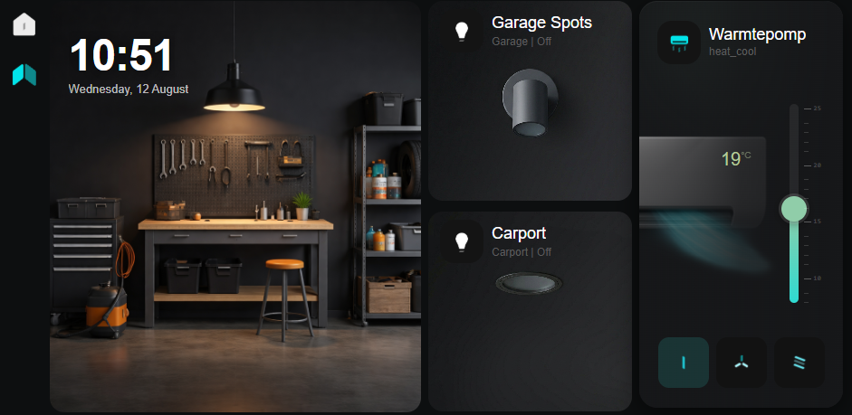

# Home Assistant Dashboard

Custom Home Assistant dashboards designed for the [Shelly Wall Display X2i](https://lazyadmin.nl/smart-home/shelly-wall-display-x2i-review/)-  a wall-mounted tablet dashboard, a garage dashboard with a custom heat pump climate card, and a mobile remote for monitoring irrigation on the go. The repo also includes the automations behind the dashboards: lux-based lighting, a weather-driven garden irrigation system, and a rain-aware robot mower scheduler.

Everything is cleaned up and anonymized with placeholder entity IDs. Fork it, replace the placeholders with your own entities, and adapt it to your setup.

The design is based on the work from [Handj on Dribbble](https://dribbble.com/shots/20757344-Smart-Home-Concept-Design-originality).

**Full write-up**: [How to Create a Home Assistant Dashboard that Actually Looks Good](https://lazyadmin.nl/smart-home/home-assistant-dashboard/)-  covers the design decisions, grid math, scene tracker pattern, lux-based automations, and irrigation model in detail.

<a href="https://www.buymeacoffee.com/LazyAdmin"></a>

## Screenshots

| Home Dashboard | Garage Dashboard |
|---|---|
|  |  |

## What's included

- **`dashboards/home_dashboard.yaml`**-  panel-mode wall tablet dashboard: time/date, scene switcher (Cozy / Gameboard / Cooking / Lights On), electricity price timeline, media player card, car status tile, and an all-lights toggle.
- **`dashboards/garage_dashboard.yaml`**-  matching wall tablet dashboard for the garage: outdoor light toggles and a custom heat pump climate card with a vertical temperature slider.
- **`dashboards/mobile_remote.yaml`**-  phone-friendly dashboard: all-lights toggle, live soil-moisture/irrigation status card, manual water valve override, and the irrigation threshold slider.
- **`dashboards/garage-climate-card.js`**-  custom Lovelace card for the heat pump (temperature slider, fan/swing mode buttons, ambient color glow).
- **`dashboards/test_dashboard.yaml`**-  minimal dashboard to verify that the required HACS cards are installed correctly.
- **`config/`**-  the backend: `configuration_snippet.yaml`, `automations.yaml`, `scenes.yaml`, `rest_commands.yaml`, and a `secrets.yaml.example`.
- **`scripts/netatmo_rain.sh`**-  shell script that reads rain data from a public Netatmo weather station for the irrigation model.
- **`themes/luxury_dashboard.yaml`**-  the dark theme used throughout.
- **`assets/`**-  icons, the Poppins font, and the AI-generated background images used by the cards.

## How the automated pieces work

### Garden irrigation (ET0 water budget model)

Every day at 07:00, `sensor.soil_moisture_balance` is recalculated as a rolling 5-day water budget:

```
balance = rain (last 5 days) + today's measured rain + (today's forecast rain x 0.5) - evapotranspiration ET0 (last 5 days)
```

- Rain and ET0 history come from the free [Open-Meteo](https://open-meteo.com/) API (no key required).
- Today's rain is measured locally via a public Netatmo weather station (`scripts/netatmo_rain.sh`), with the Open-Meteo forecast as a fallback if that station goes offline.
- If the balance drops below `input_number.irrigation_threshold` (default -12mm), the `irrigation_et0_model` automation opens the water valve for 30 minutes (~9.5mm) and sends a notification either way.

For a full deep-dive on the irrigation model, including how to set up the Netatmo API and find your station MAC addresses, read [Home Assistant Garden Irrigation Automation](https://lazyadmin.nl/smart-home/home-assistant-garden-irrigation-automation/).

### Robot mower rain-skip gate

Two automations (`mower_gate_morning` at 08:45, `mower_gate_sunday` at 12:45) check measured rain over the last 24 hours. If it exceeds 5mm, they:

1. Calculate how many hours to wait before the ground is dry enough to mow (`rain / ET0 per hour`, clamped 3-48h).
2. Store that time in `input_datetime.mower_reenable_at` and flip `input_boolean.mower_schedule_suppressed`.
3. Call the mower integration's schedule-disable service.
4. A third automation (`mower_gate_reenable`) re-enables the schedule once that time is reached.

> **This ships in dry-run mode.** Every mower service call uses `execute: false` / `confirm_schedule_write: false`, so it will NOT touch your mower until you verify the service signature against your own integration and flip those flags yourself. The example targets the `dreame_lawn_mower` integration-  swap in whatever service your own mower exposes.
>
> I am still testing this one. The concept works, but it needs more runtime before I would call it production-ready.

## Prerequisites

Install these via [HACS](https://hacs.xyz/) (Frontend):

1. **button-card**
2. **layout-card**
3. **card-mod**
4. **stack-in-card**
5. **price-timeline-card** (or swap in your own energy-price card)
6. **kiosk-mode** (hides the header/sidebar on the wall tablets for a chosen user)

You will also need:

- A Tibber (or other) electricity price sensor if you want the price timeline card-  otherwise remove that card.
- A weather/rain data source for irrigation-  this repo uses Open-Meteo (free, no key) plus a public Netatmo station as a local reading.
- A robot mower integration if you want the rain-skip gate-  otherwise skip the `mower_gate_*` automations.

## Setup

1. **Copy the dashboard files** into your Home Assistant `/config/dashboards/` folder, and `garage-climate-card.js` alongside them.
2. **Copy assets** into `/config/www/assets/` (so they are served at `/local/assets/...`) and the theme into `/config/themes/`.
3. **Register the custom card** as a Lovelace resource: Settings → Dashboards → Resources → Add → `/local/assets/../dashboards/garage-climate-card.js` (or wherever you placed it under `www/`), type: JavaScript Module.
4. **Merge `config/configuration_snippet.yaml`** into your `configuration.yaml` (dashboards, `input_*` helpers, template/REST/command_line sensors).
5. **Copy `config/automations.yaml` and `config/scenes.yaml`** in, or merge them into your existing files.
6. **Copy `config/rest_commands.yaml`** in (used to turn a wall-mounted tablet's screen on/off via a Shelly device-  adjust or remove if you don't have one).
7. **Copy `config/secrets.yaml.example` to `secrets.yaml`** (or merge the key into your existing one) and fill in your real values.
8. **Set up `scripts/netatmo_rain.sh`** with your own Netatmo API credentials and coordinates (see comments in the file), or replace the `command_line` sensor with a different local rain source.
9. **Replace every placeholder entity ID** (see table below) with your own.
10. Reload YAML configuration (Developer Tools → YAML → all sections), then create the three dashboards in Settings → Dashboards using the Raw configuration editor and pasting each file's contents.
11. Apply the `luxury_dashboard` theme to your profile (or per-dashboard).

## Replacing the placeholder entity IDs

Nothing here will work until you point it at your own devices. Search and replace across `dashboards/`, `config/automations.yaml`, and `config/scenes.yaml`:

| Placeholder | What it should be |
|---|---|
| `light.kitchen_spot_1/2/3`, `light.kitchen_pendant_1/2`, `light.coffee_corner` | Your kitchen lights |
| `light.family_room`, `light.corridor` | Any two lights on a staggered morning/evening schedule |
| `light.sofa_floor_lamp`, `light.floor_lamp_1/2/3`, `light.window_floor_lamp` | Your living room floor lamps |
| `light.entrance`, `light.hall`, `light.media_cabinet`, `light.dining_table`, `light.dining_cabinet`, `switch.cabinet_accent_light` | Other indoor lights |
| `light.kitchen_led_strip_1/2` | Kitchen LED strips |
| `light.front_door_wall`, `light.outdoor_spot_1`, `light.living_room_wall`, `light.master_bedroom_wall`, `light.master_bedroom_outdoor_wall`, `light.laundry_wall`, `light.exterior_spot` | Outdoor wall lights |
| `light.carport`, `light.carport_light_0/1` | Carport/garage lights (`carport` is a light group target) |
| `climate.garage_heat_pump` | Your garage climate entity |
| `media_player.living_room_media_player`, `button.living_room_radio_preset` | Your media player and any preset button |
| `sensor.car_battery_range`, `sensor.car_fuel_range`, `sensor.car_battery`, `sensor.car_charging_status`, `sensor.car_fuel_amount` | Your car integration's sensors (or delete the car card) |
| `sensor.wall_display_illuminance` | The lux sensor driving the lighting automations |
| `switch.irrigation_valve` | Your irrigation valve/relay switch |
| `sensor.soil_moisture_balance`, `sensor.open_meteo_rain_5d`, `sensor.open_meteo_et0_5d`, `sensor.open_meteo_rain_forecast_today`, `sensor.netatmo_rain_24h`, `sensor.mower_et0_per_hour` | Created automatically by `configuration_snippet.yaml`-  no rename needed unless you want different names |
| `notify.mobile_app_your_phone` | Your own `notify.mobile_app_<device>` target |
| `walldisplay` (in `kiosk_mode.user_settings.users`) | The HA username the header/sidebar should be hidden for |
| `<YOUR_LATITUDE>` / `<YOUR_LONGITUDE>` / `<YOUR_TIMEZONE>` | Your home's coordinates, in the Open-Meteo REST sensor |
| `dreame_lawn_mower.set_schedule_plan_enabled` + `plan_id` | Your own mower integration's schedule-control service |

## Customizing

- **Scene buttons**: edit the `scene.*` entity IDs in the dashboard YAML (`scene.sleep_mode`, `scene.lights_on`, `scene.cozy_mode`, `scene.gameboard_mode`, `scene.cooking_mode`, `scene.family_room_lights_on`).
- **Background art**: swap the files in `assets/` for your own-  same filenames, or update the `card_mod` templates that reference them.
- **Layout**: the tablet dashboards are built from `layout-card` grids at 960x472 CSS pixels (the Shelly Wall Display X2i's 1440x720 physical resolution divided by its 1.5x device pixel ratio, minus browser chrome). Adjust the `grid-template-columns`/`rows` values for your own screen-  run `console.log(window.innerWidth + 'x' + window.innerHeight)` in the browser console to find your usable canvas.

## Troubleshooting

- **Images not loading**: confirm files are in `/config/www/assets/` and filenames match exactly (case-sensitive).
- **Custom cards showing errors**: verify the HACS cards above are installed and check the browser console.
- **Theme not applying**: reload themes in Developer Tools, hard-refresh the browser.
- **Irrigation/mower automations doing nothing**: check that `sensor.soil_moisture_balance`, `sensor.open_meteo_*`, and `sensor.netatmo_rain_24h` have real values in Developer Tools → States before expecting the automations to fire.

## License

See [LICENSE](LICENSE). Feel free to fork, adapt, and share.